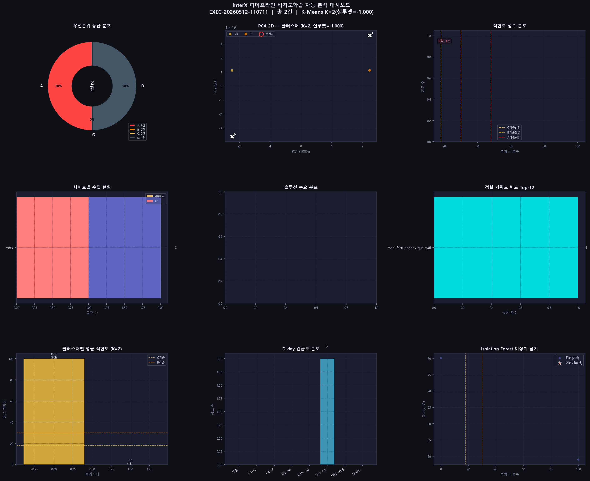
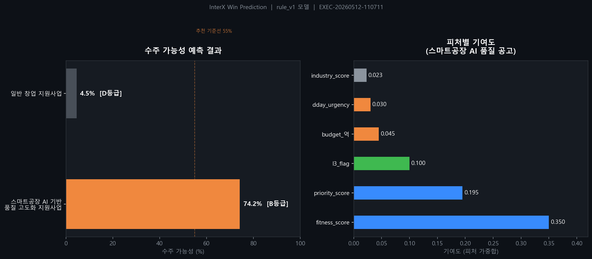

# InterX Government Intelligence Engine

정부지원사업 공고를 자동 수집·점수화·분류해 Google Sheets CRM에 업로드하는 파이프라인.

## 실행

```bash
# 전체 파이프라인 (기본)
venv/Scripts/python run_engine.py

# 옵션
venv/Scripts/python run_engine.py --full          # 클러스터링·파트너매칭·알림 포함
venv/Scripts/python run_engine.py --dry-run       # Mock 데이터로 테스트
venv/Scripts/python run_engine.py --no-sheets     # Sheets 업로드 없이 실행
venv/Scripts/python run_engine.py --no-alert      # 알림 비활성화
venv/Scripts/python run_engine.py --no-detail     # 상세 페이지 방문 생략 (빠른 실행)
venv/Scripts/python run_engine.py --sites bizinfo,bipa,kiat  # 특정 사이트만

# 테스트
venv/Scripts/python -m pytest tests/unit/ -v --tb=short
venv/Scripts/python -m pytest tests/ -v

# 대시보드
streamlit run src/interx_engine/interfaces/dashboard/app.py
```

## 디렉토리 구조

```
interx_gov_intelligence/
├── run_engine.py                        # 단일 진입점
├── configs/
│   ├── settings.yaml                    # 전역 설정 (페이지수, 타임아웃 등)
│   ├── scoring.yaml                     # 점수 가중치 및 등급 기준
│   ├── sites.yaml                       # 수집 대상 사이트 목록 (enabled 플래그)
│   ├── sheets.yaml                      # Google Sheets 컬럼 매핑
│   ├── manager_rules.yaml               # 담당자 자동 배정 규칙
│   └── competitors.yaml                 # 경쟁사 추적 대상
│
└── src/interx_engine/
    ├── core/                            # 도메인 (외부 의존성 없음)
    │   ├── entities/
    │   │   ├── notice.py                # 공고 엔티티
    │   │   ├── score_card.py            # 채점 결과
    │   │   ├── partner.py               # 파트너사
    │   │   ├── recommendation.py        # BD 추천 액션
    │   │   ├── cluster.py               # 공고 클러스터
    │   │   ├── prediction_result.py     # 수주 예측 결과
    │   │   ├── analysis_report.py       # 포트폴리오 분석 리포트
    │   │   └── attachment.py            # 첨부파일
    │   └── rules/
    │       ├── priority_scoring_policy.py  # 점수 계산 핵심 로직
    │       ├── l3_strong_policy.py         # L3 강공고 필터
    │       └── recommendation_rules.py     # BD 액션 추천 규칙
    │
    ├── application/                     # Use Cases & Orchestrators
    │   ├── ports/
    │   │   ├── notice_collector_port.py
    │   │   ├── sheet_gateway_port.py
    │   │   ├── alert_gateway_port.py
    │   │   └── partner_repository_port.py
    │   ├── use_cases/
    │   │   ├── score_notices.py         # 스코어링
    │   │   ├── deduplicate_notices.py   # TF-IDF 중복 제거
    │   │   ├── detect_changes.py        # 공고 변경 감지
    │   │   ├── assign_manager.py        # 담당자 자동 배정
    │   │   ├── assign_milestone.py      # BD 마일스톤 배정
    │   │   ├── track_competitors.py     # 경쟁사 트래킹
    │   │   ├── match_partners.py        # 파트너사 매칭
    │   │   ├── recommend_notices.py     # BD 추천 생성
    │   │   ├── cluster_notices.py       # 공고 클러스터링
    │   │   ├── alert_notices.py         # 알림 발송
    │   │   ├── site_quality_grader.py   # 사이트 품질 등급
    │   │   ├── deep_parsing.py          # 첨부파일 정밀 파싱 (PDF/HWP)
    │   │   ├── portfolio_analysis.py    # 포트폴리오 분석
    │   │   ├── win_prediction.py        # 수주 가능성 예측 (ML)
    │   │   ├── generate_proposal.py     # 제안서 초안 자동 생성
    │   │   ├── export_training_data.py  # ML 학습데이터 JSONL 저장
    │   │   ├── summarize_l3.py          # L3 공고 Claude API 요약
    │   │   ├── auto_analysis.py         # 비지도학습 자동 분석
    │   │   ├── download_attachments.py  # 첨부파일 다운로드
    │   │   └── log_pipeline_run.py      # 파이프라인 실행 로그
    │   ├── mappers/
    │   │   ├── notice_mapper.py         # Notice → Sheets 행 변환
    │   │   ├── kpi_mapper.py            # KPI/통계/로그 행 빌더
    │   │   └── attachment_mapper.py     # 첨부파일 행 변환
    │   └── orchestrators/
    │       ├── daily_pipeline.py        # 수집→스코어링→업로드 전체 흐름
    │       └── full_pipeline.py         # daily + 클러스터링·파트너매칭·알림
    │
    ├── infrastructure/                  # 외부 구현체
    │   ├── config/
    │   │   └── settings_loader.py       # 설정 싱글턴
    │   ├── collectors/
    │   │   ├── collector_factory.py     # 사이트별 콜렉터 팩토리
    │   │   ├── html_utils.py            # HTML 파싱 공통 유틸
    │   │   └── sites/
    │   │       ├── base_collector.py    # BaseCollector / PlaywrightBaseCollector
    │   │       ├── bizinfo_collector.py # 기업마당
    │   │       ├── iris_collector.py    # IRIS (국가과학기술지식정보서비스)
    │   │       ├── kiat_collector.py    # 한국산업기술진흥원
    │   │       ├── smba_collector.py    # 중소벤처기업부
    │   │       ├── nipa_collector.py    # 정보통신산업진흥원
    │   │       ├── innopolis_collector.py  # 연구개발특구진흥재단
    │   │       ├── bipa_collector.py    # 부산정보산업진흥원
    │   │       ├── uipa_collector.py    # 울산정보산업진흥원
    │   │       ├── gicon_collector.py   # 광주정보문화산업진흥원
    │   │       ├── ttp_collector.py     # 대전테크노파크
    │   │       ├── dicia_collector.py   # 한국첨단의료산업진흥재단
    │   │       ├── gjtp_collector.py    # 광주테크노파크
    │   │       ├── gbtp_collector.py    # 경북테크노파크
    │   │       ├── jntp_collector.py    # 전남테크노파크
    │   │       ├── jbtp_collector.py    # 전북테크노파크
    │   │       ├── jejutp_collector.py  # 제주테크노파크
    │   │       ├── new_collectors.py    # NRF·KISED·KETEP·KOIIA
    │   │       ├── ntis_collector.py    # NTIS (스캐폴드)
    │   │       └── mock_notice_collector.py  # 테스트용 Mock
    │   ├── sheets/
    │   │   ├── google_sheet_gateway.py  # 실제 Google Sheets 연동
    │   │   └── console_sheet_gateway.py # 콘솔 Fallback
    │   ├── persistence/
    │   │   └── sqlite_writer.py         # SQLite 영속성
    │   ├── alert/
    │   │   ├── telegram_gateway.py      # Telegram 알림
    │   │   └── slack_gateway.py         # Slack 알림
    │   ├── clustering/
    │   │   ├── tfidf_clusterer.py       # TF-IDF 클러스터링
    │   │   └── embedding_clusterer.py   # Sentence-Transformers 클러스터링
    │   ├── matching/
    │   │   └── csv_partner_repository.py  # CSV 파트너 저장소
    │   ├── storage/
    │   │   ├── csv_writer.py            # CSV Fallback 저장
    │   │   └── file_downloader.py       # 첨부파일 다운로더
    │   ├── analysis/
    │   │   ├── pandas_analyzer.py       # pandas 분석
    │   │   └── sklearn_clusterer.py     # sklearn 클러스터링
    │   └── utils/
    │       ├── budget_parser.py         # 예산 문자열 정규화
    │       └── morpheme_scorer.py       # 형태소 점수 계산
    │
    └── interfaces/
        └── dashboard/
            └── app.py                   # Streamlit 대시보드

tests/
├── unit/                                # 엔티티·매퍼·정책 단위 테스트
└── integration/                         # 파이프라인 dry-run, settings 검증
```

## 실행 결과 스크린샷

### 파이프라인 자동 분석 대시보드
> 파이프라인 실행마다 자동 생성 (`data/analysis/`) — 등급 분포, PCA 클러스터, 키워드 빈도, 이상치 탐지 등



### 수주 가능성 예측 (Win Prediction)
> 공고별 수주 확률 + 피처별 기여도 시각화 (rule_v1 기반, sklearn ML 모델 학습 시 자동 전환)



---

## 파이프라인 구동 흐름

`run_engine.py` → `DailyPipelineOrchestrator.run()` 순서로 아래 17단계가 순차 실행됩니다.

```
[1]  수집 (Collect)
     └─ 20개+ 사이트 콜렉터를 ThreadPoolExecutor로 병렬 실행
        각 콜렉터는 목록 페이지 → 상세 페이지 2단계 수집

[2]  notice_id 중복 제거
     └─ site + URL MD5 해시로 생성된 notice_id 기준 중복 제거

[2B] SQLite 기존 공고 필터
     └─ 30일 내 이미 수집된 공고는 is_new=False 마킹

[3]  마감 지난 공고 제거
     └─ deadline_date < 오늘 인 공고 자동 제거

[4]  스코어링 (Scoring)
     └─ 가점/감점 키워드 + 솔루션별 점수 → fitness·priority·grade 계산

[5]  TF-IDF 중복 제거
     └─ 제목 코사인 유사도 0.85 이상이면 중복으로 판단, 점수 낮은 것 제거

[6]  변경 감지 (Change Detection)
     └─ 이전 실행 대비 제목·예산·마감일 변경 여부 감지

[7]  담당자 자동 배정
     └─ manager_rules.yaml 키워드 매칭으로 담당자 자동 배정

[7B] BD 마일스톤 자동 배정
     └─ 등급·D-Day 기준으로 BD 단계(Qualify/Proposal/Submit) 배정

[8]  경쟁사 트래킹
     └─ competitors.yaml에 등록된 경쟁사 공고 감지 및 플래그

[9]  사이트별 품질 등급
     └─ 수집 성공률·점수 분포로 사이트 데이터 품질 A~D 등급

[10] 행 빌드 (Row Build)
     └─ Notice + ScoreCard → Google Sheets 업로드용 딕셔너리 변환

[11] 부가 분석 (병렬 처리)
     ├─ DeepParsing   : 첨부파일(PDF/HWP) 정밀 파싱 → 예산·KPI 추출
     ├─ L3 AI 요약    : Claude API로 L3 강공고 자동 요약 (API Key 필요)
     ├─ 포트폴리오 분석: pandas 기반 등급 분포·키워드 트렌드 리포트
     ├─ 수주 예측     : rule_v1 가중합 or sklearn ML 모델
     └─ 제안서 생성   : A/B 등급 공고 Word .docx 초안 자동 생성

[12] KPI / 실행 로그 빌드
     └─ 실행 통계(수집수·등급분포·소요시간 등) 행 생성

[13] 학습 데이터 자동 Export
     └─ C/D 등급 포함 전체 공고를 JSONL로 data/exports/training/ 저장

[14] Google Sheets 업로드
     └─ 7개 시트에 분산 저장 (마스터·L3·긴급·KPI·통계·로그·에러)

[15] SQLite 저장
     └─ data/interx.db 에 실행 결과 영속화

[16] 알림 발송
     └─ L3 강공고 즉시 알림 + 일별 요약 (Telegram 또는 Slack)

[17] 자동 비지도학습 분석 + PNG 생성
     └─ PCA 클러스터·이상치 탐지·키워드 빈도 등 9패널 차트 자동 저장
        → data/analysis/dashboard_EXEC-YYYYMMDD-HHMMSS.png
```

---

## HTML 파싱 방식

수집은 **2단계 파싱**으로 이루어집니다.

### 1단계 — 목록 페이지 파싱 (`_parse_page`)

각 사이트 콜렉터가 상속하는 `BaseCollector`가 페이지를 순회하며 공고를 수집합니다.

```
목록 URL 요청 (requests + Retry 어댑터)
    └─ JS 렌더링 필요 사이트 (bizinfo, kiat, dicia)
       → PlaywrightBaseCollector: headless Chromium으로 렌더링 후 파싱
    └─ 일반 사이트
       → requests.get → BeautifulSoup lxml 파싱

각 <tr> 또는 <li> 행에서:
  ├─ <a href> → 공고 제목 + 상세 URL 추출
  ├─ 날짜 패턴 정규식 → 게시일·마감일 추출
  └─ notice_id = site_key + URL MD5 해시(8자리)

중복 감지: seen_ids set으로 동일 페이지 내 중복 제거
빈 페이지 감지: 공고 0건이면 마지막 페이지로 판단 → 순회 중단
페이지 간 딜레이: random.uniform(0.5, 1.2)초 (서버 부하 방지)
```

### 2단계 — 상세 페이지 보강 (`_enrich_notices`)

목록에서 수집한 공고의 상세 URL을 재방문해 본문·예산·첨부파일을 추가합니다.

```
상세 URL 방문 (ThreadPoolExecutor, 최대 3 워커 병렬)
    └─ BeautifulSoup → script/style/nav/header/footer 태그 제거
    └─ GNB/LNB/SNB div 네비게이션 제거 (메뉴 텍스트 오염 방지)

본문 텍스트 정제
  └─ get_text(" ", strip=True) → 연속 공백 제거 → 최대 8,000자 저장

예산 추출 (정규식 우선순위 순)
  1. "지원금액 : N억원"
  2. "총 사업비 : N백만원"
  3. "과제당 : N억원"
  4. "최대 N억원"
  5. "N억원 이내/내외/규모"

구조화 섹션 추출
  └─ 사업목적 / 지원내용 / 지원대상 / 지원금액 / 신청방법 / 추진일정
     각 섹션 헤더 키워드 탐지 → 다음 섹션까지 최대 300자 저장

첨부파일 추출
  └─ <a href> 중 .pdf/.hwp/.docx/.xlsx 확장자 또는
     download/fileDown/atchFile 패턴 URL → {name, url} 목록 수집

방문 간 딜레이: random.uniform(0.3, 0.8)초
```

---

## 스코어링 알고리즘

`PriorityScoringPolicy.calculate(notice)` → `ScoreCard` 반환

### 점수 계산 구조

```
scored_text = 제목 + 요약 + 사업목적 + 지원내용   (body_text 제외 — 오염 방지)
full_text   = scored_text + body_text              (코어 키워드 체크에만 사용)

1. 코어 키워드 존재 여부 (full_text 기준)
   └─ {제조, 스마트공장, AI, 데이터, 실증 ...} 중 하나라도 없으면 fitness=0

2. 가점 계산 (scored_text 기준)
   └─ POSITIVE_KEYWORDS 딕셔너리 순회
      예: "스마트공장"=5, "AI"=3, "데이터"=2 ...
      구조화 섹션(사업목적/지원내용)에서 히트 시 ×1.5 보너스
      예산 정보 존재 시 +3.0 보너스

3. 감점 계산 (scored_text 기준)
   └─ NEGATIVE_KEYWORDS 딕셔너리 순회
      예: "수요기업"=12, "일자리"=7, "세미나"=7, "소상공인"=6 ...
      → 비제조·비조달 공고 필터링

4. 적합도 (fitness) = pos_score×5 - neg_score×6 + struct_bonus
   범위: 0.0 ~ 100.0

5. 솔루션별 점수 (7개 솔루션)
   ManufacturingDT / RecipeAI / QualityAI / InspectionAI
   SafetyAI / GenAI / InfraDS / PdM
   └─ 각 솔루션 키워드 합산 × scale(15) → 0~100점

6. 산업 점수 (industry_score) = 비0점 솔루션 평균

7. 우선순위 (priority) = fitness×0.6 + industry_score×0.4
   └─ fitness=0이면 priority 강제 0 (industry 기여 차단)

8. 등급 (grade)
   A : priority ≥ 55   (최우선 영업 대상)
   B : priority ≥ 40   (검토 대상)
   C : priority ≥ 25   (모니터링)
   D : priority <  25   (해당 없음)

9. 제목 블랙리스트 강제 D
   └─ 제목에 "수요기업", "육성과정", "시찰단" 포함 시
      fitness=0, priority=0, grade=D 강제 설정

10. L3 강공고 판정
    └─ fitness ≥ 35 AND 제목에 L3 핵심 키워드 존재
       (스마트공장/제조AI/디지털트윈/머신비전/예지보전 등)
       → notice.l3_strong = "Y" → 즉시 Telegram/Slack 알림 대상
```

### 추천 솔루션 자동 매핑

```
sol_scores 상위 3개 솔루션 이름을 " / " 로 연결
예: "ManufacturingDT / QualityAI / GenAI"
    → Google Sheets 01_영업기회_정보 시트의 "추천솔루션" 컬럼에 자동 기재
```

---

## 수주 예측 (Win Prediction)

### rule_v1 — 즉시 사용 가능 (외부 패키지 불필요)

```python
score = (
    fitness_score  × 0.350   # 적합도 (가장 중요)
  + priority_score × 0.195   # 우선순위 점수
  + l3_flag        × 0.100   # L3 강공고 여부
  + budget_억      × 0.045   # 예산 규모 (억원 단위)
  + dday_urgency   × 0.030   # D-Day 긴급도
  + industry_score × 0.023   # 솔루션 산업 점수
) / 정규화 → 0~100%

등급: A≥60% / B≥40% / C≥20% / D<20%
```

### sklearn ML 모드 — 데이터 누적 후 자동 전환

```
파이프라인 실행마다:
  data/exports/training/EXEC-YYYYMMDD-HHMMSS.jsonl 에 공고 데이터 자동 누적

충분한 데이터 쌓이면 학습 실행:
  from interx_engine.application.use_cases.win_prediction import WinPredictionTrainer
  WinPredictionTrainer().train()
  → data/models/win_pred_lr.pkl 생성

이후 파이프라인 실행 시:
  pkl 파일 감지 → LogisticRegression 모델 자동 로드 → rule_v1 대체
```

---

## 엔진 출력 데이터 & BD 플랫폼 적용 가이드

### 공고 1건당 생성되는 핵심 필드

| 필드 | 설명 | BD 활용 |
|------|------|---------|
| `fitness_score` | 키워드 매칭 기반 적합도 (0~100) | 영업 우선순위 판단 기준 |
| `priority_grade` | A / B / C / D 종합 등급 | 리드 등급 분류 |
| `win_probability` | 수주 가능성 0~1 (룰 또는 ML) | 파이프라인 기대 매출 계산 |
| `l3_strong` | L3 강공고 여부 Y/N | "즉시 대응" 리드 분류 |
| `recommended_solution` | ManufacturingDT / SafetyAI / InfraDS 등 | 어떤 제품으로 제안할지 |
| `body_text` | 공고 원문 전체 | 제안서 자동 초안 근거 |
| `deadline_date` / `D-day` | 마감일 및 남은 일수 | 영업 액션 타이밍 |
| `budget` | 지원 예산 | 우선순위 및 기대 수주액 |
| `agency` / `ministry` | 수행기관 / 주무부처 | 고객사 / 발주처 식별 |
| `partner_candidate` | 파트너사 후보 Y/N | 컨소시엄 구성 판단 |
| `milestone` | BD 진행 단계 M01~M05 자동 배정 | CRM 파이프라인 스테이지 |
| `recurring` | 정기공고 여부 + 그룹명 | 재계약·연간 기회 예측 |

---

### 자동 생성 대시보드 차트 (9패널)

파이프라인 실행마다 `data/analysis/dashboard_{execution_id}.png` 로 자동 저장됩니다.

```
┌──────────────┬──────────────┬──────────────┐
│ ① 등급 분포   │ ② PCA 산점도  │ ③ 적합도 히스 │
├──────────────┼──────────────┼──────────────┤
│ ④ 사이트 현황 │ ⑤ 솔루션 수요 │ ⑥ 키워드 빈도 │
├──────────────┼──────────────┼──────────────┤
│ ⑦ 클러스터   │ ⑧ D-day 분포 │ ⑨ 이상치 탐지 │
└──────────────┴──────────────┴──────────────┘
```

| 차트 | 의미 | 플랫폼 활용 |
|------|------|------------|
| ① 우선순위 등급 분포 (도넛) | 전체 공고 중 A/B/C/D 비율 | 파이프라인 상단 등급 필터 버튼 기준 |
| ② PCA 2D 산점도 | 6개 피처를 2차원으로 압축한 공고 분포, 색깔=클러스터 빨간 테두리=이상치 | "비슷한 공고 묶음" 그룹 탭 설계 기준 |
| ③ 적합도 분포 히스토그램 | C기준(18) / B기준(30) / A기준(48) 수직선 표시 | 적합도 슬라이더 필터 구간 기준 |
| ④ 사이트별 수집 현황 | 전체(파랑) · A/B등급(노랑) · L3강공고(빨강) 막대 | 발굴 채널 효율성 KPI |
| ⑤ 솔루션 수요 분포 | 공고에서 추천된 우리 솔루션별 공고 수 | 제품별 파이프라인 규모 / 영업 인력 배치 |
| ⑥ 적합 키워드 빈도 Top-12 | 공고 본문 키워드 등장 빈도 | 월별 누적 시 시장 키워드 트렌딩 |
| ⑦ 클러스터별 평균 적합도 | K-Means 그룹별 우리 적합도 평균 | 집중 공략 세그먼트 선정 |
| ⑧ D-day 긴급도 분포 | 오늘/D1~3/D4~7 등 구간별 마감 임박 공고 수 | 긴급 알림 배지 설계 기준 |
| ⑨ Isolation Forest 이상치 | 적합도×D-day 기준 비정형 공고 (상위 5%) 탐지 | ⚠️ 검토 요망 리드 자동 플래그 |

---

### BD 플랫폼 구조 제안

```
BD 플랫폼
├── 오늘의 브리핑
│   ├── 신규 공고 N건 (new_count)
│   ├── 긴급 마감 공고 (D-day ≤ 3)
│   └── L3 강공고 목록 (l3_strong = Y)
│
├── 파이프라인 뷰 (등급 탭: A / B / C / D)
│   ├── 리드 카드 — 제목 · 기관 · 마감 · 추천솔루션 · 담당자
│   ├── 수주확률 바 (win_probability 0~100%)
│   └── BD 마일스톤 스테이지 (M01 → M05)
│
├── 제안서 뷰
│   └── data/proposals/*.docx 목록 + 다운로드 (A/B 등급 자동 생성)
│
└── 설정
    └── CRM 결과 입력 (수주/탈락 → data/crm_memos.json → ML 재학습 트리거)
```

### Google Sheets → 플랫폼 연결 포인트

현재 파이프라인은 실행 후 Google Sheets에 아래 7개 시트를 자동 업로드합니다.
별도 DB 구축 없이 **Sheets API를 백엔드로 읽어 플랫폼 UI를 구성**하는 방식이 가장 빠릅니다.

| Sheets 시트 | 포함 데이터 | 플랫폼 화면 |
|------------|------------|------------|
| 01_영업기회_정보 | 전체 공고 + 등급·점수·담당자 | 파이프라인 뷰 메인 테이블 |
| 02_L3강공고 | L3강공고 필터 결과 | 오늘의 브리핑 L3 섹션 |
| 03_긴급마감 | D-day ≤ 7 공고 | 오늘의 브리핑 긴급 섹션 |
| 04_KPI | 실행별 수집·등급·소요시간 통계 | 운영 대시보드 KPI 위젯 |
| 05_통계 | 부처·솔루션·키워드 집계 | (시장 분석 참고용) |
| 06_실행로그 | 파이프라인 실행 이력 | 관리자 운영 로그 |
| 07_에러로그 | 수집 오류 사이트 목록 | 장애 모니터링 |

### 수주확률 ML 피드백 루프

```
파이프라인 실행
    └─ training/*.jsonl 자동 누적
          ↓
 영업팀이 수주/탈락 결과 입력
 (data/crm_memos.json)
          ↓
 WinPredictionTrainer().train()
 → LogisticRegression 학습
 → data/models/win_pred_lr.pkl
          ↓
 다음 실행부터 ML 모델 자동 사용
 (rule_v1 → ML 모드 자동 전환)
```

> 최소 20건 이상의 수주/탈락 실적이 누적되면 학습 가능합니다.
> 실적 데이터가 없을 경우 rule_v1 가중합 모드로 동작합니다.

---

## 핵심 원칙

- **도메인 규칙은 `core/`에만** — infrastructure에 비즈니스 로직 넣지 말 것
- **설정값은 `configs/` YAML에** — 코드에 하드코딩 금지
- **각 크롤러는 `base_collector.py` 상속** — `collect()` 메서드 구현
- `service_account.json` — Git에 올리면 안 됨 (Google 인증키)
- Playwright 필요 사이트: `kiat`, `dicia`, `bizinfo` (`playwright install chromium`)
